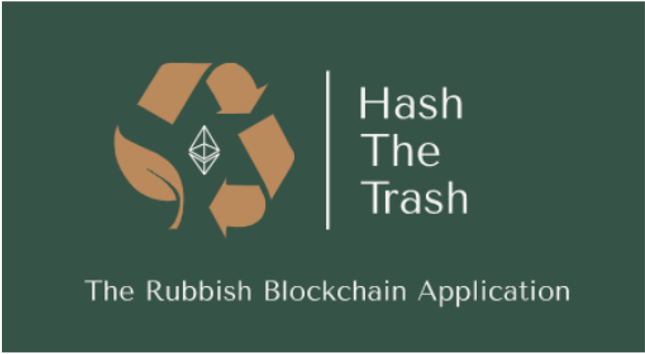

# HASH the TRASH - The Rubbish Blockchain Application
HashTheTrash is a blockchain application for real-time waste tracking, based on two Ethereum Smart Contracts. The aim of this project is to increase the transparency along all the steps of the trash chain to improve waste management processes in developed countries, such as Italy, which is taken as reference for the simulation. 

#### Why a rubbish blockchain?
Through the blockchain technology, it would be possible to track the amount of waste collected, who collected it, and where it is being moved for recycling or disposal in a truly transparent way, leading to a halt, or at least a reduction of the number of ecological crimes related to waste treatment. Moreover, waste tracing enables the definition of a "trash footprint" of each citizen that could be used to incentivize people to correctly dispose waste. In particular, tracking each trash bag from its production to its disposal would make it possible to reward citizens with some tax reductions on the basis of their recycling behavior throughout the year. 

#### Why blockchain? 
The need of a public and permissionless blockchain, such as the Ethereum one, results from the multitude of actors involved in the garbage chain, whose interests are never unified and may be malicious. Up to now, waste management supervision has remained under the control of the public sector, and there are only a few monitoring tools to check how public authorities manage the garbage chain. HashTheTrash may solve this problem and ensure an increased transparency and accountability of the public sector. 

#### Simulation 
In this GitHub repository, all the files and data needed to perform a simulation of this waste tracking system are provided. In particular, for the purpose of the simulation, a small municipality has been considered, comprising of five citizens, two garbage trucks, and two disposal stations, for a total of ten actors. Moreover, for simplicity, the garbage produced by the five citizens is simply classified as recyclable or non-recyclable, and waste collection is performed by trucks on the basis of a door-to-door system.

The whole application works with the deployment of two smart contracts, stored in the `contract` folder. The idea is that each Municipality would have to deploy both these contracts at the beginning of each year, and then destroy them at the end of each year. The Jupyter notebook `HashTheTrash.ipynb` provides a clear and straightforward simulation of the functioning of these two contracts.

**For more information about the Idea and the tackled trade-off, look at `IDEA.md`.**
 
## How to use this repo 
1. Install `requirements`:
```shell script
pip install -r requirements.txt
```
2. If not already downloaded, download [Ganache](https://www.trufflesuite.com/ganache), a developer tool that provides a personal Ethereum blockchain with 10 accounts to test Solidity contracts. 
3. Run `HashTheTrash.ipynb` to simulate the creation and collection of waste. To work correctly, this file needs:
   * 10 Ethereum external-owned accounts: they represent 1 Municipality, 5 citizens, 1 non-recyclable truck and 1 recyclable one, 1 non-recyclable disposal station and 1 recyclable one. The public keys are retrieved from the accounts provided by Ganache.
   * `example_data.xlsx`: an Excel file containing the necessary data to perform a simulation, stored in the `data` folder. 
   * 2 Smart Contracts: stored in the `contracts` folder with their corresponding ABI code. 
   
Many attempts have been made before the finalization of the last version of this repository, they are all stored in the `old_code` folder. 


## Trash Chain step-by-step
The following is a brief summary of the steps developed for the above-described Rubbish Blockchain Application. More information and descriptions are provided in `HashTheTrash.ipynb`, and in the two smart contracts. Some steps refer to an Excel sheet: it contains different external data that must be used as input for some functions embedded in the two smart contracts. The idea is that these external data are collected by off-chain tools and interact with Ethereum through Python libraries. 

### 1. AGENTS CREATION 
  - **Creation of agents** - *EXCEL SHEET = agents_data*  
It's the beginning of the year and the Municipality must deploy the `agents.sol` and `trashlife.sol` smart contracts. The latter inehrits from the former. Agents.sol contains all the necessary functions to create or delete agents. Agents are deleted if for example a citizen dies, a truck is scrapped or a station is closed. These functions can be invoked only by the Municipality to populate the list of citizens, garbage trucks and disposal stations involved in the waste chain for that year. Creating an agent means associating a certain ETH address with the corresponding information stored in the `data/example_data.xlsx/agents_data` sheet. This means that each citizen must have an ETH wallet, with some ETH to pay taxes. Trucks and Stations must also have an ETH address, but they won't use it for any money transfer. 

### 2. TARI 
  - **Municipality computes TARI for all citizens:** `function TariAmount(address _address)`  
Before the end of January, the Municipality computes the TARI that each citizen must pay, according to the following formula:<br>      
           
The amount depends on how big the house of the citizen (measured in square meter) is, and how much waste the citizen produced the previous year. More information about the TARI computation are provided in the Jupyter notebook. 

  - **All citizens pay TARI:** `function payTari() external payable onlyCitizen`    
The Municipality notifies the due TARI amount to each citizen, who must invoke the "payTari()" function to deposit it. Citizens know both the TARI amount in wei and in euro, but they must pay it in wei. Therefore, they must have ETH to process the payment. Any attempt to pay the wrong TARI amount is reverted. 

### 3. TRASH 
  - **Pick up trahs bags:** `function pick(address _citizen, uint _wasteWeight, uint _random)` - *EXCEL SHEET = bags_data*  
Each citizen has a bin with a barcode storing his name and public address. He must put each trash bag inside this personal bin and put the bin outside his house. The garbage collection is organized according to a schedule provided by the Municipality, such that recyclable and non-recyclable waste is collected during different days. Therefore, during recyclable days, the trucks' drivers appointed to the collection of recyclable waste scan the barcodes of all the bins they find in the streets, weight their content with a scale, which is integrated in each truck, and invoke the "pick()" function to register the information about the bags on the blockchain. The same happens during non-recyclable days with non-recyclable trucks' drivers. In this way, it is possible to keep track of the amount of recyclable and non-recyclable waste produced by each citizen. For the simulation, all the data collected by the scanner and the scale are stored in the `data/example_data.xlsx/bags_data` sheet. 

  - **Drop bags at disposal station:** `function drop(address _disposalStation, int _latitudeTruck, int _longitudeTruck)` - *EXCEL SHEET = gps_data*  
Trucks' drivers drop their cargo at disposal stations. To avoid a discrepancy between the waste type (recyclable or not) that the truck is carrying and the waste type that the station disposes, each driver must invoke the "drop()" function before dropping the content of the truck. This function takes as input the GPS coordinates of the truck and checks that they correspond to the location of an active disposal station. A further check is also performed to verify that the type of waste that the truck is carrying is coherent with the type of waste that the station disposes. For the stake of simulation, the data retrieved from trucks' GPS are stored in the `data/example_data.xlsx/gps_data` sheet. Moreover, this function saves in a variable the amount of waste carried and dropped by each truck. 

  - **Station last check:** `function received(bool _waste, address _truck, uint _weight)` - *EXCEL SHEET = stations_data*  
This last step aims to check whether the weight dropped by the truck and the weight declared by the station do correspond. 

### 4. REFUND
  - **Municipality computes payout for all citizens and pays:** `function computePayout(address payable _citizen)`, `function givePayout(address payable _citizen)`  At the end of the year, more specifically between 20th and 28th of December, the Municipality computes the refund that each citizen has earned on the basis of their trash footprint. This time range was chosen in order to to avoid the potential complications that could arise if, for some reasons, the Municipality did not call the "setBeginningYear" function exactly on 1st January, or if the miners took days to mine the block with the "setBeginningYear" function. To be more specific, the "setBeginningYear" function is the function by which the Municipality can set the "official" starting day of the current year. The more the citizen has recycled, the bigger the payout is going to be:<br>  
          
  
| Percentage of recycled waste (x)  | Percentage of refund |
| ------------- | ------------- |
| x < 25 %   | 0 %   |
| 25% < x < 50%  | 2 %   |
| 50% < x < 75% | 5 %  |
| x > 75 %   | 10 %  |

## Improvements: 
The project stored in this repo sets the stage for a waste tracking system and could be improved with the following measures: 
-	**Fiscal Code:** For the unique identification of citizens, their full name in the struct “Citizen” could be substituted with their fiscal code.
-	**Waste Types:** Instead of simply classifying waste as recyclable or non-recyclable, the various types of waste (e.g. plastic, paper, glass, organic, mixed) can be considered. This can be done pretty easily by substituting the Boolean “waste” (equal to true when waste is recyclable) with something on the line of `enum WasteType {Nonrecyclable, Paper, Plastic, Organic, Glass}`. The rest of the code would then need to be adapted to this small change.
-	**Other waste collection methods:** The code could also be adapted to be compatible with waste collection systems that differ from the simple door-to-door collection system.
- **Consequence of a late TARI payment:** It would also be possible to add some functionalities in the code to deal with the case of non-compliance with the time limit specified for the payment of the TARI. For example, if a citizen didn't pay the TARI on time, the Municipality could solicit the payment through, for example, a text message or an app notification, and maybe also decrease the reimbursement by a certain amount at the end of the year.
- **Payout computation:** The refund now only depends on the percentage of recyclable waste produced by each citizen. Others factors should also be taken into consideration, such as the absolute amount of non-recyclable waste produced or the possible delay in the TARI payment at the beginning of the year. 

## Privacy considerations:
For a real-life implementation of the Rubbish Blockchain, some privacy considerations could also be raised. The transparency of the blockchain has undoubtedly great advantages, since it allows to track waste through the various steps of the waste management process and thus reduces the number of ecological crimes related to waste treatment. However, this same transparency could also cause some problems. For example, assume that a malicious individual X was able to associate an Ethereum address to a specific citizen Y. By observing the transactions recorded on the blockchain, X could infer whether Y was on holiday, or in general away from his house, and burgle his house. Indeed, if for a period of time no transactions were recorded about trash bags generated by Y, X could assume that Y was not at home and take advantage of this situation. Therefore, if someone wanted to implement the Rubbish Blockchain in real life, it would be advisable to think further about the potential privacy issues that could arise from this. 

## Authors: 
 - Francesca Bianchessi 
 - Ilaria Bolla
 - Alessandro Botti
 - Davide Castellini
 - Bianca Cattadori
 - Anna Chiara Di Marco 
 - Priamo Puschiasis 
